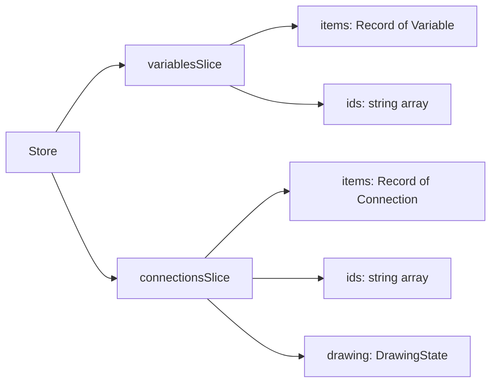
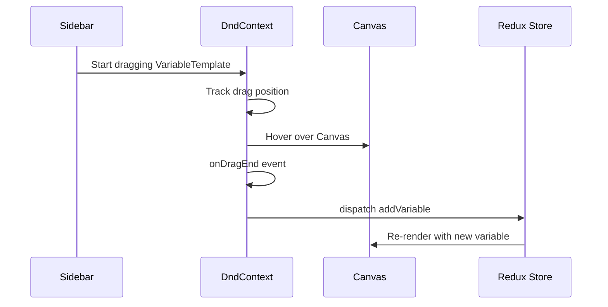
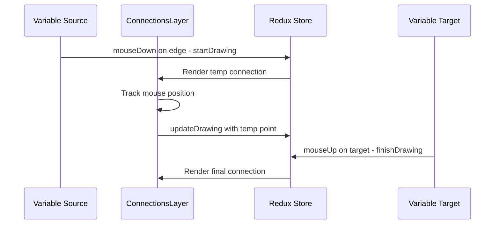
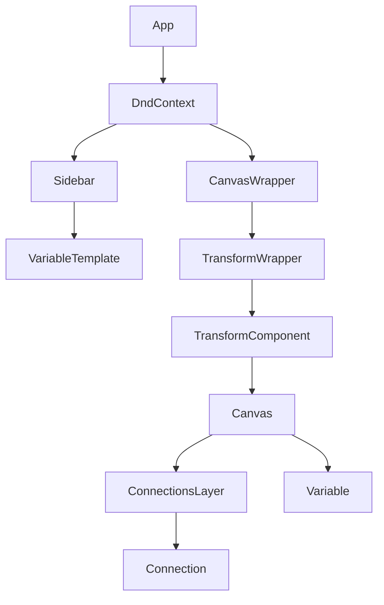

# Causal Loop Diagram - Architecture Plan

## Overview

A React + Redux application for creating Causal Loop Diagrams with:
- Drag-and-drop variables from sidebar to canvas
- Arrow drawing between variables
- Zoom/Pan functionality

## Technology Stack

| Technology | Purpose | Version |
|------------|---------|---------|
| React | UI Framework | 19.x |
| Redux Toolkit | State Management | Latest |
| @dnd-kit/core | Drag and Drop | Latest |
| react-zoom-pan-pinch | Zoom/Pan Canvas | Latest |
| TypeScript | Type Safety | 5.x |
| Module CSS | Scoped Styling | Native |
| Vite | Build Tool | 7.x |

## Architecture

### Folder Structure

```
src/
├── app/                      # App-level setup
│   ├── store.ts              # Redux store configuration
│   ├── hooks.ts              # Typed Redux hooks
│   └── App.tsx               # Main App component
├── components/               # Shared/reusable components
│   └── ui/                   # Generic UI components
├── features/                 # Feature-based modules
│   ├── sidebar/              # Sidebar feature
│   │   ├── components/
│   │   │   ├── Sidebar.tsx
│   │   │   ├── Sidebar.module.css
│   │   │   ├── VariableTemplate.tsx
│   │   │   └── VariableTemplate.module.css
│   │   └── index.ts
│   ├── canvas/               # Canvas feature
│   │   ├── components/
│   │   │   ├── Canvas.tsx
│   │   │   ├── Canvas.module.css
│   │   │   ├── CanvasWrapper.tsx
│   │   │   └── CanvasWrapper.module.css
│   │   ├── hooks/
│   │   │   └── useCanvasViewport.ts
│   │   └── index.ts
│   ├── variables/            # Variables feature
│   │   ├── components/
│   │   │   ├── Variable.tsx
│   │   │   └── Variable.module.css
│   │   ├── slice/
│   │   │   └── variablesSlice.ts
│   │   ├── types/
│   │   │   └── variable.types.ts
│   │   └── index.ts
│   └── connections/          # Connections feature
│       ├── components/
│       │   ├── Connection.tsx
│       │   ├── Connection.module.css
│       │   └── ConnectionsLayer.tsx
│       ├── slice/
│       │   └── connectionsSlice.ts
│       ├── hooks/
│       │   ├── useConnectionDrawing.ts
│       │   └── useConnectionPath.ts
│       ├── utils/
│       │   └── pathCalculations.ts
│       ├── types/
│       │   └── connection.types.ts
│       └── index.ts
├── hooks/                    # Global custom hooks
│   └── useDragAndDrop.ts
├── utils/                    # Global utilities
│   └── geometry.ts
├── types/                    # Global TypeScript types
│   └── common.types.ts
└── styles/                   # Global styles
    └── variables.css
```

### Redux Store Design



#### Types

```typescript
interface Position {
  x: number;
  y: number;
}

interface Variable {
  id: string;
  name: string;
  position: Position;
  radius: number;
}

interface Connection {
  id: string;
  sourceId: string;
  targetId: string;
}

interface DrawingState {
  isDrawing: boolean;
  sourceId: string | null;
  tempEndPoint: Position | null;
}
```

#### Actions

**variablesSlice:**
- `addVariable` - Add new variable to canvas
- `moveVariable` - Update variable position
- `removeVariable` - Delete variable
- `updateVariableName` - Change variable name

**connectionsSlice:**
- `startDrawing` - Begin arrow drawing from source
- `updateDrawing` - Update temporary end point
- `finishDrawing` - Complete connection to target
- `cancelDrawing` - Cancel drawing operation
- `removeConnection` - Delete connection

## Component Flow Diagrams

### Drag and Drop Flow



### Arrow Drawing Flow



## Key Implementation Details

### Arrow Path Calculation

The arrow should stop 15px before the target variable:

```typescript
function calculateConnectionPath(
  source: Variable,
  target: Variable,
  gap: number = 15
): PathData {
  // Calculate direction vector
  const dx = target.position.x - source.position.x;
  const dy = target.position.y - source.position.y;
  const distance = Math.sqrt(dx * dx + dy * dy);
  const normalX = dx / distance;
  const normalY = dy / distance;
  
  // Start point: edge of source circle
  const startX = source.position.x + normalX * source.radius;
  const startY = source.position.y + normalY * source.radius;
  
  // End point: 15px before target circle edge
  const endX = target.position.x - normalX * (target.radius + gap);
  const endY = target.position.y - normalY * (target.radius + gap);
  
  return { startX, startY, endX, endY };
}
```

### Edge Detection for Arrow Drawing

```typescript
function isOnEdge(
  mousePos: Position,
  circleCenter: Position,
  radius: number,
  edgeWidth: number = 10
): boolean {
  const distance = Math.sqrt(
    Math.pow(mousePos.x - circleCenter.x, 2) +
    Math.pow(mousePos.y - circleCenter.y, 2)
  );
  return distance >= radius - edgeWidth && distance <= radius + edgeWidth;
}
```

### Zoom Coordinate Transformation

```typescript
function screenToCanvas(
  screenPos: Position,
  transform: TransformState
): Position {
  return {
    x: (screenPos.x - transform.positionX) / transform.scale,
    y: (screenPos.y - transform.positionY) / transform.scale
  };
}
```

## Dependencies to Install

```bash
npm install @reduxjs/toolkit react-redux @dnd-kit/core react-zoom-pan-pinch nanoid
npm install -D @types/react-redux
```

## Component Hierarchy



## CSS Module Naming Convention

- Component: `ComponentName.tsx`
- Styles: `ComponentName.module.css`
- Class naming: camelCase for CSS modules

Example:
```css
/* Variable.module.css */
.container {
  position: absolute;
}

.circle {
  border-radius: 50%;
  cursor: move;
}

.edgeZone {
  position: absolute;
  cursor: crosshair;
}

.label {
  text-align: center;
}
```

## Scalability Considerations

1. **Normalized State** - Variables and connections stored by ID for O(1) lookups
2. **Feature-based Structure** - Easy to add new features without affecting existing code
3. **Reusable Hooks** - Common logic extracted to custom hooks
4. **Type Safety** - Full TypeScript coverage
5. **Module CSS** - Scoped styles prevent conflicts
6. **Future Extensions Ready:**
   - Polarity indicators on arrows
   - Persistence layer
   - Undo/Redo
   - Variable grouping
   - Export functionality
