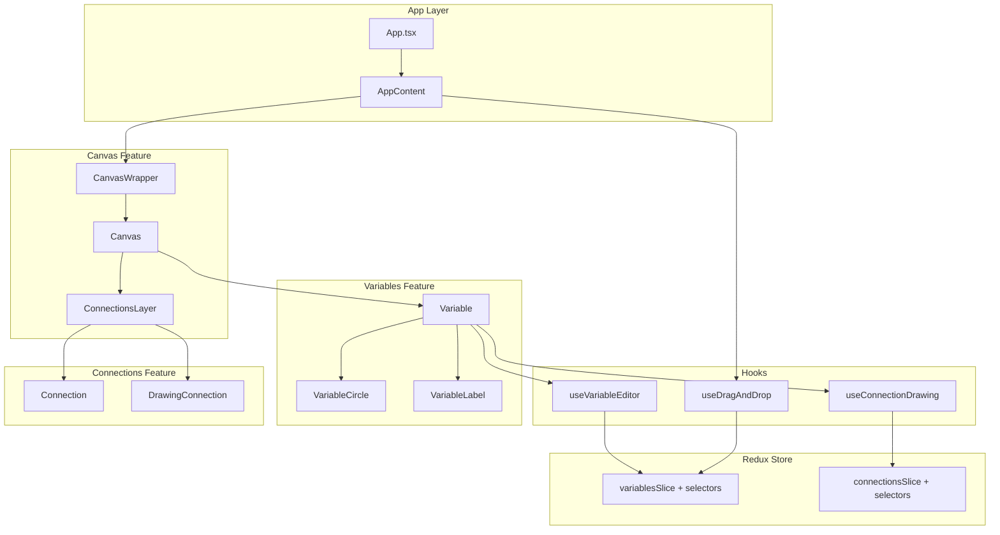

# Refactoring Plan: Causal Loop Diagram

## Overview

This plan outlines refactoring steps based on best practices from React and Redux Toolkit documentation (via Context7).

## Current State Analysis

### Positives
- ✅ Feature-based folder structure (follows RTK recommendation)
- ✅ TypeScript throughout
- ✅ Redux Toolkit with createSlice
- ✅ React functional components with hooks
- ✅ Proper separation of types into dedicated files

### Areas for Improvement

| Issue | Location | Severity |
|-------|----------|----------|
| Missing memoized selectors | Slices | High |
| Missing custom hooks for complex logic | Components | High |
| Component complexity (204 lines) | Variable.tsx | Medium |
| Unused code | App.tsx, Variable.tsx | Low |
| Magic numbers scattered | Various | Low |
| No React.memo | Variable, Connection | Medium |

---

## Phase 1: Add Memoized Selectors to Redux Slices

### Context7 Reference
> The toolkit encourages defining selectors directly within the createSlice API using the `selectors` field with `createSelector` for memoization.

### Changes

#### 1.1 Update `variablesSlice.ts`

```typescript
import { createSlice, createSelector, type PayloadAction } from '@reduxjs/toolkit';

export const variablesSlice = createSlice({
  name: 'variables',
  initialState,
  reducers: { /* existing */ },
  selectors: {
    selectAllVariables: (state) => state.items,
    selectVariableIds: (state) => state.ids,
    selectSelectedId: (state) => state.selectedId,
    selectVariableById: (state, id: string) => state.items[id],
    selectSelectedVariable: createSelector(
      (state: VariablesState) => state.items,
      (state: VariablesState) => state.selectedId,
      (items, selectedId) => selectedId ? items[selectedId] : null
    ),
  },
});

export const {
  selectAllVariables,
  selectVariableIds,
  selectSelectedId,
  selectVariableById,
  selectSelectedVariable,
} = variablesSlice.selectors;
```

#### 1.2 Update `connectionsSlice.ts`

```typescript
selectors: {
  selectAllConnections: (state) => state.items,
  selectConnectionIds: (state) => state.ids,
  selectDrawingState: (state) => state.drawing,
  selectIsDrawing: (state) => state.drawing?.isDrawing ?? false,
  selectConnectionById: (state, id: string) => state.items[id],
  selectConnectionsByVariableId: createSelector(
    (state: ConnectionsState) => state.items,
    (state: ConnectionsState, variableId: string) => variableId,
    (items, variableId) => 
      Object.values(items).filter(
        conn => conn.sourceId === variableId || conn.targetId === variableId
      )
  ),
}
```

### Files to Modify
- [`src/features/variables/slice/variablesSlice.ts`](src/features/variables/slice/variablesSlice.ts)
- [`src/features/connections/slice/connectionsSlice.ts`](src/features/connections/slice/connectionsSlice.ts)
- [`src/features/variables/index.ts`](src/features/variables/index.ts)
- [`src/features/connections/index.ts`](src/features/connections/index.ts)

---

## Phase 2: Extract Custom Hooks

### Context7 Reference
> Custom Hooks should be named after their specific, high-level purposes, making the calling component more declarative and readable.

### 2.1 Create `useDragAndDrop` Hook

**Purpose**: Handle all DnD context logic from App.tsx

**Location**: `src/features/canvas/hooks/useDragAndDrop.ts`

```typescript
export function useDragAndDrop() {
  const dispatch = useAppDispatch();
  const variables = useAppSelector(selectAllVariables);
  const [activeDragType, setActiveDragType] = useState<DragType>(null);
  const [variableCount, setVariableCount] = useState(1);
  const currentPointerPosition = useRef<Position | null>(null);

  const sensors = useSensors(
    useSensor(PointerSensor, {
      activationConstraint: { distance: 5 },
    })
  );

  const handleDragStart = useCallback((event: DragStartEvent) => { /* ... */ }, []);
  const handleDragMove = useCallback((event: DragMoveEvent) => { /* ... */ }, []);
  const handleDragEnd = useCallback((event: DragEndEvent) => { /* ... */ }, [dispatch, variableCount, variables]);
  const handleDragCancel = useCallback(() => { /* ... */ }, []);

  return {
    sensors,
    activeDragType,
    handlers: {
      onDragStart: handleDragStart,
      onDragMove: handleDragMove,
      onDragEnd: handleDragEnd,
      onDragCancel: handleDragCancel,
    },
  };
}
```

### 2.2 Create `useConnectionDrawing` Hook

**Purpose**: Handle connection drawing interactions

**Location**: `src/features/connections/hooks/useConnectionDrawing.ts`

```typescript
export function useConnectionDrawing(variableId: string, position: Position) {
  const dispatch = useAppDispatch();
  const isDrawing = useAppSelector(selectIsDrawing);
  const drawingSourceId = useAppSelector(state => state.connections.drawing?.sourceId);

  const startDrawingConnection = useCallback(() => {
    if (!isDrawing) {
      dispatch(startDrawing({ sourceId: variableId, startPoint: position }));
    }
  }, [dispatch, variableId, position, isDrawing]);

  const finishDrawingConnection = useCallback(() => {
    if (isDrawing && drawingSourceId && drawingSourceId !== variableId) {
      dispatch(finishDrawing({ targetId: variableId }));
    }
  }, [dispatch, isDrawing, drawingSourceId, variableId]);

  const isValidTarget = isDrawing && drawingSourceId !== variableId;

  return {
    isDrawing,
    isValidTarget,
    startDrawingConnection,
    finishDrawingConnection,
  };
}
```

### 2.3 Create `useVariableEditor` Hook

**Purpose**: Handle variable name editing state and logic

**Location**: `src/features/variables/hooks/useVariableEditor.ts`

```typescript
export function useVariableEditor(variable: Variable) {
  const dispatch = useAppDispatch();
  const [isEditing, setIsEditing] = useState(false);
  const [editValue, setEditValue] = useState(variable.name);
  const inputRef = useRef<HTMLInputElement>(null);

  useEffect(() => {
    if (isEditing && inputRef.current) {
      inputRef.current.focus();
      inputRef.current.select();
    }
  }, [isEditing]);

  const startEditing = useCallback(() => {
    setIsEditing(true);
    setEditValue(variable.name);
  }, [variable.name]);

  const submitEdit = useCallback(() => {
    if (editValue.trim()) {
      dispatch(updateVariableName({ id: variable.id, name: editValue.trim() }));
    } else {
      setEditValue(variable.name);
    }
    setIsEditing(false);
  }, [dispatch, variable.id, variable.name, editValue]);

  const cancelEdit = useCallback(() => {
    setEditValue(variable.name);
    setIsEditing(false);
  }, [variable.name]);

  return {
    isEditing,
    editValue,
    inputRef,
    setEditValue,
    startEditing,
    submitEdit,
    cancelEdit,
  };
}
```

### Files to Create
- `src/features/canvas/hooks/useDragAndDrop.ts`
- `src/features/canvas/hooks/index.ts`
- `src/features/connections/hooks/useConnectionDrawing.ts`
- `src/features/connections/hooks/index.ts`
- `src/features/variables/hooks/useVariableEditor.ts`
- `src/features/variables/hooks/index.ts`

### Files to Modify
- [`src/app/App.tsx`](src/app/App.tsx) - Use useDragAndDrop
- [`src/features/variables/components/Variable.tsx`](src/features/variables/components/Variable.tsx) - Use useVariableEditor, useConnectionDrawing

---

## Phase 3: Split Variable Component

### Current Problem
Variable.tsx is 204 lines with mixed responsibilities:
- Dragging
- Editing
- Connection drawing
- Selection
- Rendering

### Solution: Extract Sub-components

#### 3.1 VariableCircle Component

```typescript
// src/features/variables/components/VariableCircle.tsx
interface VariableCircleProps {
  radius: number;
  isSelected: boolean;
  isDragging: boolean;
  isConnectionTarget: boolean;
  listeners: Record<string, unknown>;
  attributes: Record<string, unknown>;
}

export const VariableCircle = memo(function VariableCircle({
  radius,
  isSelected,
  isDragging,
  isConnectionTarget,
  listeners,
  attributes,
}: VariableCircleProps) {
  return (
    <div
      className={cn(
        styles.circle,
        isSelected && styles.selected,
        isDragging && styles.dragging,
        isConnectionTarget && styles.connectionTarget
      )}
      style={{ width: radius * 2, height: radius * 2 }}
      {...listeners}
      {...attributes}
    />
  );
});
```

#### 3.2 VariableLabel Component

```typescript
// src/features/variables/components/VariableLabel.tsx
interface VariableLabelProps {
  name: string;
  isEditing: boolean;
  editValue: string;
  inputRef: React.RefObject<HTMLInputElement>;
  onEditChange: (value: string) => void;
  onSubmit: () => void;
  onKeyDown: (e: React.KeyboardEvent) => void;
}

export const VariableLabel = memo(function VariableLabel({ ... }: VariableLabelProps) {
  if (isEditing) {
    return (
      <input
        ref={inputRef}
        className={`${styles.labelInput} no-pan`}
        value={editValue}
        onChange={(e) => onEditChange(e.target.value)}
        onBlur={onSubmit}
        onKeyDown={onKeyDown}
        onClick={(e) => e.stopPropagation()}
      />
    );
  }

  return <span className={`${styles.label} no-pan`}>{name}</span>;
});
```

### Files to Create
- `src/features/variables/components/VariableCircle.tsx`
- `src/features/variables/components/VariableLabel.tsx`

### Files to Modify
- [`src/features/variables/components/Variable.tsx`](src/features/variables/components/Variable.tsx)

---

## Phase 4: Add React.memo Optimization

### Components to Wrap with memo

| Component | Reason |
|-----------|--------|
| Variable | Receives stable variable object, re-renders often |
| Connection | Receives stable connection object |
| VariableTemplate | Static props |
| ZoomControls | No props |

### Implementation

```typescript
// Variable.tsx
export const Variable = memo(function Variable({ variable }: VariableProps) {
  // ...
});

// Connection.tsx
export const Connection = memo(function Connection({ connection }: ConnectionProps) {
  // ...
});
```

### Files to Modify
- [`src/features/variables/components/Variable.tsx`](src/features/variables/components/Variable.tsx)
- [`src/features/connections/components/Connection.tsx`](src/features/connections/components/Connection.tsx)
- [`src/features/sidebar/components/VariableTemplate.tsx`](src/features/sidebar/components/VariableTemplate.tsx)

---

## Phase 5: Create Shared Constants

### Create `src/constants/canvas.ts`

```typescript
// Canvas dimensions
export const CANVAS_WIDTH = 3000;
export const CANVAS_HEIGHT = 2000;

// Drag activation
export const DRAG_ACTIVATION_DISTANCE = 5;

// Zoom limits
export const MIN_SCALE = 0.25;
export const MAX_SCALE = 2;
export const INITIAL_SCALE = 1;
```

### Create `src/constants/index.ts`

```typescript
export * from './canvas';
export { DEFAULT_VARIABLE_RADIUS } from '../features/variables/types/variable.types';
export { CONNECTION_GAP, ARROW_HEAD_SIZE } from '../features/connections/types/connection.types';
```

### Files to Create
- `src/constants/canvas.ts`
- `src/constants/index.ts`

### Files to Modify
- [`src/features/canvas/components/Canvas.tsx`](src/features/canvas/components/Canvas.tsx)
- [`src/features/canvas/components/CanvasWrapper.tsx`](src/features/canvas/components/CanvasWrapper.tsx)

---

## Phase 6: Remove Unused Code

### Items to Remove

| Item | Location | Reason |
|------|----------|--------|
| `activeDragId` state | App.tsx | Set but never read |
| `isConnectionTarget` prop | Variable.tsx | Not used meaningfully |
| `onEdgeMouseDown` prop | Variable.tsx | Optional, not used by parent |
| `clickTimerRef` | Variable.tsx | Defined but not used |

### Files to Modify
- [`src/app/App.tsx`](src/app/App.tsx)
- [`src/features/variables/components/Variable.tsx`](src/features/variables/components/Variable.tsx)

---

## Phase 7: Add Barrel Exports for Hooks

### Update Feature Index Files

```typescript
// src/features/variables/index.ts
export { useVariableEditor } from './hooks/useVariableEditor';

// src/features/connections/index.ts
export { useConnectionDrawing } from './hooks/useConnectionDrawing';

// src/features/canvas/index.ts
export { useDragAndDrop } from './hooks/useDragAndDrop';
```

---

## Architecture Diagram (After Refactoring)



---

## Implementation Order

1. **Phase 1**: Add selectors (foundation for other changes)
2. **Phase 5**: Create constants (needed by hooks)
3. **Phase 2**: Extract hooks (major refactoring)
4. **Phase 3**: Split Variable component
5. **Phase 4**: Add React.memo
6. **Phase 6**: Remove unused code
7. **Phase 7**: Update barrel exports

---

## Testing Checklist

After each phase, verify:
- [ ] App builds without errors (`npm run build`)
- [ ] No TypeScript errors
- [ ] Drag and drop variables works
- [ ] Connection drawing works
- [ ] Variable editing works
- [ ] Zoom and pan works
- [ ] No console errors
