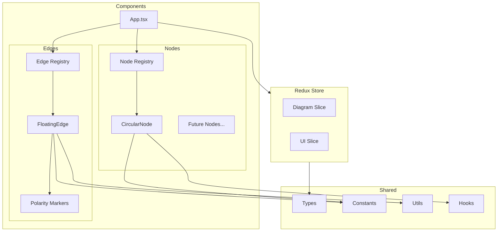
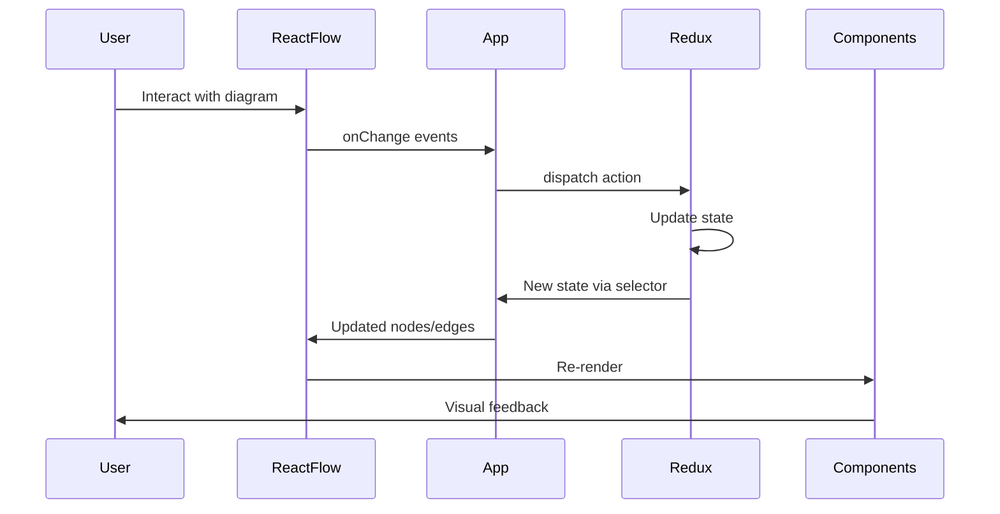

# CLD Editor Refactoring Plan

## Overview

Refactoring the Causal Loop Diagram (CLD) visual editor to use Redux for state management and create an extensible architecture for nodes and edges.

## Current Issues

1. **Duplicated Constants** - `RADIUS`, `OUTER_THRESHOLD`, `INNER_THRESHOLD` are defined in multiple files:
   - `src/components/CircularNode.tsx`
   - `src/components/FloatingEdge.tsx`
   - `src/components/utils/edgeUtils.ts`

2. **Tight Coupling** - State management logic is in `App.tsx` using React Flow hooks, not scalable for complex features

3. **No Abstraction Layer** - Components are concrete implementations without base interfaces/types for extensibility

4. **Circular Dependencies** - `FloatingEdge` imports `UpdateEdgeData` type from `App.tsx`

5. **Mixed Concerns** - Components, utilities, and types are not clearly separated

---

## Target Architecture

### New Project Structure

```
src/
├── store/                          # Redux store
│   ├── index.ts                    # Store configuration
│   ├── hooks.ts                    # Typed hooks (useAppDispatch, useAppSelector)
│   └── slices/
│       ├── diagramSlice.ts         # Nodes, edges, selection state
│       └── uiSlice.ts              # UI state (sidebar, editing mode, etc.)
│
├── types/                          # TypeScript type definitions
│   ├── node.ts                     # Node-related types
│   ├── edge.ts                     # Edge-related types
│   ├── diagram.ts                  # Diagram-level types
│   └── index.ts                    # Re-exports
│
├── constants/                      # Shared constants
│   ├── node.ts                     # Node dimensions, colors
│   ├── edge.ts                     # Edge styles, colors
│   └── index.ts                    # Re-exports
│
├── components/
│   ├── nodes/                      # Node components
│   │   ├── CircularNode/
│   │   │   ├── CircularNode.tsx
│   │   │   └── index.ts
│   │   ├── registry.ts             # Node registry and factory
│   │   └── index.ts                # Exports nodeTypes
│   │
│   ├── edges/                      # Edge components
│   │   ├── FloatingEdge/
│   │   │   ├── FloatingEdge.tsx
│   │   │   └── index.ts
│   │   ├── markers/                # SVG markers
│   │   │   ├── ArrowMarker.tsx
│   │   │   ├── PolarityMarker.tsx
│   │   │   └── index.ts
│   │   ├── registry.ts             # Edge registry and factory
│   │   └── index.ts                # Exports edgeTypes
│   │
│   └── ui/                         # UI components
│       ├── Toolbar.tsx
│       ├── PropertyPanel.tsx
│       └── index.ts
│
├── hooks/                          # Custom React hooks
│   ├── useNodeHandles.ts           # Handle position logic
│   ├── useDiagram.ts               # Diagram operations
│   └── index.ts
│
├── utils/                          # Utility functions
│   ├── geometry.ts                 # Geometric calculations
│   ├── edge.ts                     # Edge path calculations
│   └── index.ts
│
├── App.tsx                         # Main app component
├── App.css
└── main.tsx                        # Entry point with providers
```

---

## Type Definitions

### Node Types

```typescript
// src/types/node.ts

import type { Node, NodeProps } from '@xyflow/react';

// Base data that all nodes share
export interface BaseNodeData extends Record<string, unknown> {
  label: string;
  notes?: string;
  color?: string;
}

// Available node variants
export type NodeVariant = 'circular' | 'rectangular' | 'diamond' | 'cloud';

// CLD Node extending React Flow Node
export interface CLDNode<T extends BaseNodeData = BaseNodeData> extends Node<T> {
  type: NodeVariant;
}

// Node configuration for registry
export interface NodeConfig<T extends BaseNodeData = BaseNodeData> {
  type: NodeVariant;
  component: React.ComponentType<NodeProps<CLDNode<T>>>;
  defaultData: () => T;
  displayName: string;
  icon?: React.ReactNode;
  description?: string;
}
```

### Edge Types

```typescript
// src/types/edge.ts

import type { Edge, EdgeProps } from '@xyflow/react';

// CLD-specific polarity
export type Polarity = 'positive' | 'negative' | 'neutral';

// Edge visual styles
export type EdgeLineStyle = 'solid' | 'dashed' | 'dotted';

// Base data that all edges share
export interface BaseEdgeData extends Record<string, unknown> {
  polarity: Polarity;
  label?: string;
  notes?: string;
  delay?: boolean;           // CLD delay indicator (||)
  lineStyle?: EdgeLineStyle;
  // Connection positioning
  sourceAngle?: number;
  targetAngle?: number;
  curveOffset?: { x: number; y: number };
}

// Available edge variants
export type EdgeVariant = 'floating' | 'straight' | 'step';

// CLD Edge extending React Flow Edge
export interface CLDEdge<T extends BaseEdgeData = BaseEdgeData> extends Edge<T> {
  type: EdgeVariant;
}

// Edge configuration for registry
export interface EdgeConfig<T extends BaseEdgeData = BaseEdgeData> {
  type: EdgeVariant;
  component: React.ComponentType<EdgeProps<CLDEdge<T>>>;
  defaultData: () => T;
  displayName: string;
  description?: string;
}
```

---

## Redux Store Structure

### Diagram Slice

```typescript
// src/store/slices/diagramSlice.ts

import { createSlice, PayloadAction } from '@reduxjs/toolkit';
import { applyNodeChanges, applyEdgeChanges, NodeChange, EdgeChange } from '@xyflow/react';
import type { CLDNode, CLDEdge } from '../../types';

interface DiagramState {
  nodes: CLDNode[];
  edges: CLDEdge[];
  selectedNodeIds: string[];
  selectedEdgeIds: string[];
}

const initialState: DiagramState = {
  nodes: [],
  edges: [],
  selectedNodeIds: [],
  selectedEdgeIds: [],
};

export const diagramSlice = createSlice({
  name: 'diagram',
  initialState,
  reducers: {
    // Node operations
    addNode: (state, action: PayloadAction<CLDNode>) => {
      state.nodes.push(action.payload);
    },
    updateNode: (state, action: PayloadAction<{ id: string; changes: Partial<CLDNode> }>) => {
      const index = state.nodes.findIndex(n => n.id === action.payload.id);
      if (index !== -1) {
        state.nodes[index] = { ...state.nodes[index], ...action.payload.changes };
      }
    },
    updateNodeData: (state, action: PayloadAction<{ id: string; data: Partial<CLDNode['data']> }>) => {
      const node = state.nodes.find(n => n.id === action.payload.id);
      if (node) {
        node.data = { ...node.data, ...action.payload.data };
      }
    },
    removeNode: (state, action: PayloadAction<string>) => {
      state.nodes = state.nodes.filter(n => n.id !== action.payload);
      // Also remove connected edges
      state.edges = state.edges.filter(
        e => e.source !== action.payload && e.target !== action.payload
      );
    },
    
    // Edge operations
    addEdge: (state, action: PayloadAction<CLDEdge>) => {
      state.edges.push(action.payload);
    },
    updateEdge: (state, action: PayloadAction<{ id: string; changes: Partial<CLDEdge> }>) => {
      const index = state.edges.findIndex(e => e.id === action.payload.id);
      if (index !== -1) {
        state.edges[index] = { ...state.edges[index], ...action.payload.changes };
      }
    },
    updateEdgeData: (state, action: PayloadAction<{ id: string; data: Partial<CLDEdge['data']> }>) => {
      const edge = state.edges.find(e => e.id === action.payload.id);
      if (edge && edge.data) {
        edge.data = { ...edge.data, ...action.payload.data };
      }
    },
    removeEdge: (state, action: PayloadAction<string>) => {
      state.edges = state.edges.filter(e => e.id !== action.payload);
    },
    
    // React Flow change adapters
    onNodesChange: (state, action: PayloadAction<NodeChange<CLDNode>[]>) => {
      state.nodes = applyNodeChanges(action.payload, state.nodes) as CLDNode[];
    },
    onEdgesChange: (state, action: PayloadAction<EdgeChange<CLDEdge>[]>) => {
      state.edges = applyEdgeChanges(action.payload, state.edges) as CLDEdge[];
    },
    
    // Selection
    setSelection: (state, action: PayloadAction<{ nodeIds: string[]; edgeIds: string[] }>) => {
      state.selectedNodeIds = action.payload.nodeIds;
      state.selectedEdgeIds = action.payload.edgeIds;
    },
    
    // Bulk operations
    setDiagram: (state, action: PayloadAction<{ nodes: CLDNode[]; edges: CLDEdge[] }>) => {
      state.nodes = action.payload.nodes;
      state.edges = action.payload.edges;
    },
    clearDiagram: (state) => {
      state.nodes = [];
      state.edges = [];
      state.selectedNodeIds = [];
      state.selectedEdgeIds = [];
    },
  },
});
```

### UI Slice

```typescript
// src/store/slices/uiSlice.ts

import { createSlice, PayloadAction } from '@reduxjs/toolkit';

type EditingMode = 'select' | 'addNode' | 'addEdge' | 'pan';
type SidebarPanel = 'properties' | 'nodes' | 'settings' | null;

interface UIState {
  editingMode: EditingMode;
  sidebarPanel: SidebarPanel;
  sidebarWidth: number;
  showMinimap: boolean;
  showGrid: boolean;
  pendingNodeType: string | null; // Type of node to add on next click
}

const initialState: UIState = {
  editingMode: 'select',
  sidebarPanel: null,
  sidebarWidth: 280,
  showMinimap: true,
  showGrid: true,
  pendingNodeType: null,
};

export const uiSlice = createSlice({
  name: 'ui',
  initialState,
  reducers: {
    setEditingMode: (state, action: PayloadAction<EditingMode>) => {
      state.editingMode = action.payload;
    },
    setSidebarPanel: (state, action: PayloadAction<SidebarPanel>) => {
      state.sidebarPanel = action.payload;
    },
    setSidebarWidth: (state, action: PayloadAction<number>) => {
      state.sidebarWidth = action.payload;
    },
    toggleMinimap: (state) => {
      state.showMinimap = !state.showMinimap;
    },
    toggleGrid: (state) => {
      state.showGrid = !state.showGrid;
    },
    setPendingNodeType: (state, action: PayloadAction<string | null>) => {
      state.pendingNodeType = action.payload;
    },
  },
});
```

---

## Registry Pattern

### Node Registry

```typescript
// src/components/nodes/registry.ts

import type { NodeTypes } from '@xyflow/react';
import type { NodeConfig, NodeVariant, BaseNodeData } from '../../types';
import { CircularNode } from './CircularNode';

// Registry of all available node types
const nodeRegistry: Record<NodeVariant, NodeConfig> = {
  circular: {
    type: 'circular',
    component: CircularNode,
    defaultData: () => ({
      label: 'Variable',
      notes: '',
    }),
    displayName: 'Variable (Circular)',
    description: 'Standard CLD variable node',
  },
  // Future node types:
  rectangular: { /* ... */ },
  diamond: { /* ... */ },
  cloud: { /* ... */ },
};

// Create nodeTypes object for React Flow
export const nodeTypes: NodeTypes = Object.fromEntries(
  Object.entries(nodeRegistry).map(([key, config]) => [key, config.component])
);

// Factory function to create new nodes
export function createNode(
  type: NodeVariant,
  position: { x: number; y: number },
  id?: string
): CLDNode {
  const config = nodeRegistry[type];
  return {
    id: id ?? nanoid(),
    type,
    position,
    data: config.defaultData(),
  };
}

// Get all available node configs (for toolbar/palette)
export function getNodeConfigs(): NodeConfig[] {
  return Object.values(nodeRegistry);
}
```

### Edge Registry

```typescript
// src/components/edges/registry.ts

import type { EdgeTypes } from '@xyflow/react';
import type { EdgeConfig, EdgeVariant, BaseEdgeData, Polarity } from '../../types';
import { FloatingEdge } from './FloatingEdge';

const edgeRegistry: Record<EdgeVariant, EdgeConfig> = {
  floating: {
    type: 'floating',
    component: FloatingEdge,
    defaultData: () => ({
      polarity: 'positive' as Polarity,
      delay: false,
      lineStyle: 'solid',
    }),
    displayName: 'Floating Edge',
    description: 'Curved edge with adjustable connection points',
  },
  // Future edge types
};

export const edgeTypes: EdgeTypes = Object.fromEntries(
  Object.entries(edgeRegistry).map(([key, config]) => [key, config.component])
);

export function createEdge(
  type: EdgeVariant,
  source: string,
  target: string,
  polarity: Polarity = 'positive',
  id?: string
): CLDEdge {
  const config = edgeRegistry[type];
  return {
    id: id ?? nanoid(),
    type,
    source,
    target,
    data: {
      ...config.defaultData(),
      polarity,
    },
  };
}
```

---

## Constants

```typescript
// src/constants/node.ts

// Common node dimensions
export const NODE_RADIUS = 40;
export const NODE_INNER_THRESHOLD = 10;  // How far inside edge to start showing handles
export const NODE_OUTER_THRESHOLD = 10;  // How far outside edge to keep showing handles

// Node colors
export const NODE_COLORS = {
  default: {
    background: '#6366f1',
    border: '#4338ca',
    text: '#ffffff',
  },
  selected: {
    background: '#818cf8',
    border: '#6366f1',
    text: '#ffffff',
  },
  hover: {
    background: '#a5b4fc',
    border: '#818cf8',
    text: '#ffffff',
  },
} as const;

// Handle indicator
export const HANDLE_INDICATOR = {
  size: 12,
  color: '#22c55e',
  borderColor: '#16a34a',
} as const;


// src/constants/edge.ts

// Edge visual properties
export const EDGE_STROKE_WIDTH = 1.5;
export const EDGE_HOVER_STROKE_WIDTH = 4;
export const EDGE_GAP = 15;  // Gap between edge and node circle

// Edge colors
export const EDGE_COLORS = {
  default: '#1a1a1a',
  hover: '#3b82f6',
  positive: '#22c55e',
  negative: '#ef4444',
  neutral: '#6b7280',
} as const;

// Arrow configuration
export const ARROW_SIZE = 8;

// Control point calculation
export const BASE_CONTROL_DISTANCE = 50;

// Polarity marker
export const POLARITY_MARKER = {
  size: 14,
  offset: 20,  // Distance from target along edge
  fontSize: 12,
  fontWeight: 'bold',
} as const;
```

---

## Implementation Phases

### Phase 1: Foundation
1. Create `src/constants/node.ts` with node dimensions and colors
2. Create `src/constants/edge.ts` with edge styles and colors  
3. Create `src/constants/index.ts` re-exporting all constants
4. Create `src/types/node.ts` with node type definitions
5. Create `src/types/edge.ts` with edge type definitions
6. Create `src/types/diagram.ts` with diagram-level types
7. Create `src/types/index.ts` re-exporting all types

### Phase 2: Redux Setup
1. Create `src/store/slices/diagramSlice.ts`
2. Create `src/store/slices/uiSlice.ts`
3. Create `src/store/index.ts` with store configuration
4. Create `src/store/hooks.ts` with typed hooks
5. Update `src/main.tsx` to wrap app with Redux Provider

### Phase 3: Component Refactoring
1. Create `src/components/nodes/registry.ts`
2. Refactor `CircularNode` to use shared constants
3. Move `CircularNode` to `src/components/nodes/CircularNode/`
4. Create `src/components/edges/registry.ts`
5. Refactor `FloatingEdge` to use shared constants and Redux
6. Move `FloatingEdge` to `src/components/edges/FloatingEdge/`
7. Create polarity markers in `src/components/edges/markers/`
8. Create `src/hooks/useNodeHandles.ts` extracting handle logic

### Phase 4: CLD Features
1. Add polarity rendering to `FloatingEdge`
2. Add delay indicator rendering
3. Refactor `App.tsx` to use Redux store
4. Create basic `PropertyPanel` component for editing selected elements
5. Clean up unused files and imports

---

## Mermaid Diagrams

### Component Architecture



### Data Flow



---

## Notes

- Use composition over inheritance for extensibility
- Keep component-local state for purely visual concerns like hover
- Use Redux for all diagram data and user selections
- React Flow handles are for mouse interaction only - actual positions calculated in edge utils
- Polarity can be visually indicated by:
  - Color of the edge line
  - +/- marker near the arrowhead
  - Different arrow head styles
