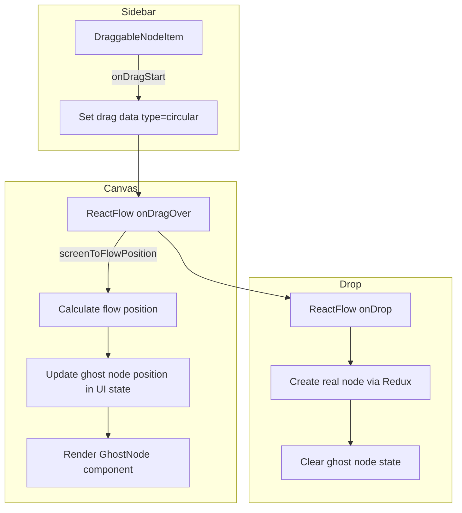

# Sidebar with Drag-and-Drop Implementation Plan

## Overview

Добавить боковую панель (sidebar) с элементами для перетаскивания на canvas. При перетаскивании элемента на canvas должен отображаться предварительный просмотр (ghost/preview) позиции узла.

## Requirements

1. **Sidebar** - боковая панель слева с доступными типами узлов
2. **Draggable Items** - элементы в sidebar, которые можно перетаскивать
3. **Live Preview** - как только курсор попадает на canvas, показывать светлую версию узла
4. **Drop to Create** - при отпускании создаётся реальный узел

## Architecture



## New Components

### 1. `Sidebar.tsx`
- Контейнер боковой панели
- Содержит список доступных типов узлов
- Стилизация и layout

### 2. `DraggableNodeItem.tsx`
- Компонент перетаскиваемого элемента в sidebar
- Использует HTML5 Drag API
- Props: `nodeType`, `label`, `icon`

### 3. `GhostNode.tsx`
- Компонент-призрак для preview при drag
- Отображается полупрозрачным цветом
- Позиционируется в координатах потока

## State Management

### UI Slice расширение в `uiSlice.ts`

```typescript
interface DragState {
  isDragging: boolean;
  nodeType: NodeVariant | null;
  ghostPosition: { x: number; y: number } | null;
}

interface UIState {
  // existing fields...
  drag: DragState;
}
```

### Actions
- `setDragStart(nodeType)` - начало перетаскивания
- `setGhostPosition(position | null)` - обновление позиции ghost
- `setDragEnd()` - конец перетаскивания

## Implementation Steps

### Step 1: Extend UI State
Добавить состояние для drag-and-drop в `uiSlice.ts`:
- `drag.isDragging` - флаг активного перетаскивания
- `drag.nodeType` - тип перетаскиваемого узла
- `drag.ghostPosition` - позиция ghost узла в координатах flow

### Step 2: Create Sidebar Component
Создать компонент `src/components/Sidebar/Sidebar.tsx`:
- Фиксированная позиция слева
- Заголовок Nodes
- Список DraggableNodeItem

### Step 3: Create DraggableNodeItem Component
Создать `src/components/Sidebar/DraggableNodeItem.tsx`:
- `draggable=true`
- `onDragStart` - устанавливает dataTransfer и dispatch setDragStart
- Визуал как preview того, что будет создано

### Step 4: Create GhostNode Component
Создать `src/components/GhostNode.tsx`:
- Отрисовывается когда `drag.isDragging && drag.ghostPosition !== null`
- Полупрозрачная версия CircularNode
- Абсолютное позиционирование внутри ReactFlow

### Step 5: Update App.tsx
Интегрировать drag-and-drop в основной компонент:
- Добавить Sidebar в layout
- Добавить обработчики `onDragOver` и `onDrop` на ReactFlow
- Рендерить GhostNode когда активен drag

### Step 6: Add Styles
Обновить `App.css` со стилями для:
- Sidebar layout
- Draggable items
- Ghost node opacity/styling
- Layout grid для sidebar + canvas

## File Structure After Implementation

```
src/
├── components/
│   ├── Sidebar/
│   │   ├── index.ts
│   │   ├── Sidebar.tsx
│   │   └── DraggableNodeItem.tsx
│   ├── GhostNode.tsx
│   ├── CircularNode.tsx
│   └── ...
├── store/
│   └── slices/
│       ├── uiSlice.ts      # extended with drag state
│       └── diagramSlice.ts
└── App.tsx                  # updated with DnD handlers
```

## Technical Details

### screenToFlowPosition
Используется хук `useReactFlow()` для получения функции `screenToFlowPosition`:
```typescript
const { screenToFlowPosition } = useReactFlow();

const onDragOver = (event: React.DragEvent) => {
  event.preventDefault();
  event.dataTransfer.dropEffect = 'move';
  
  const position = screenToFlowPosition({
    x: event.clientX,
    y: event.clientY,
  });
  
  dispatch(uiActions.setGhostPosition(position));
};
```

### Ghost Node Rendering
Ghost node отрисовывается как обычный React Flow node но с особым стилем:
```typescript
const ghostNodes = ghostPosition ? [{
  id: 'ghost',
  type: 'circular',
  position: ghostPosition,
  data: { label: '?' },
  style: { opacity: 0.5, pointerEvents: 'none' },
  selectable: false,
  draggable: false,
}] : [];

// В ReactFlow nodes={[...nodes, ...ghostNodes]}
```

### Node Creation on Drop
```typescript
const onDrop = (event: React.DragEvent) => {
  event.preventDefault();
  
  const type = event.dataTransfer.getData('application/reactflow');
  if (!type) return;
  
  const position = screenToFlowPosition({
    x: event.clientX,
    y: event.clientY,
  });
  
  const newNode: CLDNode = {
    id: `node_${Date.now()}`,
    type: 'circular',
    position,
    data: { label: getNextLabel() },
  };
  
  dispatch(diagramActions.addNode(newNode));
  dispatch(uiActions.setDragEnd());
};
```

## Visual Design

### Sidebar
- Ширина: 200-250px
- Фон: светло-серый (#f8f9fa)
- Border справа
- Padding для элементов

### DraggableNodeItem
- Отображает миниатюру узла
- При наведении - подсветка
- Cursor: grab / grabbing

### GhostNode
- Opacity: 0.4-0.5
- Тот же цвет что и обычный node но светлее
- Без теней и эффектов hover

## Alternative Approach - Direct DOM Ghost

Альтернативный подход без добавления в nodes массив:
- Рендерить отдельный div поверх canvas
- Трансформировать координаты самостоятельно учитывая zoom и pan
- Более производительно для частых обновлений

Выбор: **Использовать ReactFlow nodes массив** - проще интегрируется, автоматически учитывает все трансформации.
